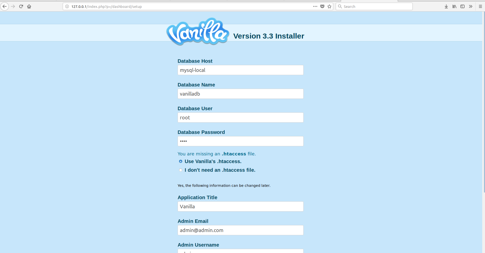

# Topcoder - Forums

## Requirements

- Docker (docker deployment)

## Docker Deployment with all services
- Create `vanilla.env` and copy the contents of  `sample.vanilla.env` into `vanilla.env`. Configure parameters.
- Create `mysql.env` and copy the contents of  `sample.mysql.env` into `mysql.env`. Configure parameters.    
`MYSQL_DATABASE` and `MYSQL_ROOT_PASSWORD` might be changed. You need to use these values during Vanilla Forums
installation.These variables are mandatory. 
  `MYSQL_ROOT_PASSWORD` specifies the password that will be set for the MySQL root superuser account.
- Run `docker-compose -f docker-compose.yml -f docker-compose.dev.yml build` to build the image
- Run `docker-compose -f docker-compose.yml -f docker-compose.dev.yml up` to run Vanilla Forums
- The Vanilla Forums will be available at `http://<your_docker_machine_ip>` by default

## Local Deployment with local mysql
- Create `vanilla.env` and copy the contents of  `sample.vanilla.env` into `vanilla.env`. Configure parameters.
- Create `mysql.env` and copy the contents of  `sample.mysql.env` into `mysql.env`. Configure parameters.
  `MYSQL_DATABASE` and `MYSQL_ROOT_PASSWORD` might be changed. You need to use these values during Vanilla Forums
  installation.These variables are mandatory.
  `MYSQL_ROOT_PASSWORD` specifies the password that will be set for the MySQL root superuser account.
- Make sure `MYSQL_HOST` is set to `mysql-local` in both `vanilla.env` and `mysql.env`
- Go to file `config/vanilla/config.php` and change the parameter `$Configuration['Garden']['Installed']` to `false` as shown below
  ```
    $Configuration['Garden']['Installed'] = false;
  ```
- Run `docker-compose -f docker-compose.yml -f docker-compose.local.yml build --build-arg BRANCH=develop` to build the image
- Run `docker-compose -f docker-compose.yml -f docker-compose.local.yml up` to run Vanilla Forums
- After it is done, go to `localhost` in your browser
- You should be able to see the page similar to below
  
- Follow the instructions in [Setup Vanilla Forums](./docs/SetupVanillaForums.md) to complete installation.

## Docker Deployment with existing MySql
- You need to know how connect to MySQL Database:
     - **Database Host**  
     - **Database Name** 
     - **Database User** 
     - **Database Password**
  These parameters will be used in Vanilla Forums Installation Wizard.   
- Create `vanilla.env` and copy the contents of  `sample.vanilla.env` into `vanilla.env`. Configure parameters.
- Run `docker-compose build` to build the image
- Run `docker-compose up` to run Vanilla Forums
- The Vanilla Forums will be available at `http://<your_docker_machine_ip>` by default

## Setup Vanilla Forums 

Go to [Setup Vanilla Forums](./docs/SetupVanillaForums.md) to complete installation.

## Build Vanilla Forums

Go to [Build Vanilla Forums](./docs/BuildVanillaForums.md) to install dependencies and build assets. 
