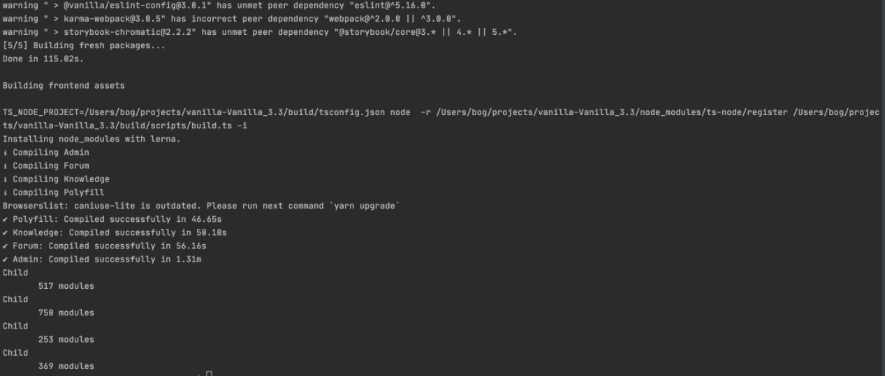

# Build Vanilla Forums

Vanilla Forums has pre-built frontend assets (js, css and addons assets).

The full source code is https://github.com/vanilla/vanilla/tree/Vanilla_3.3.

## Requirements

- Node.js “>=8.0.0 <12.0.0”
- PHP 7.2 - 7.4 (as of Vanilla 3.3)
- Yarn
- Composer 

## Installing yarn

Install yarn:
 
`npm install -g yarn`

## Installing composer

Install composer:

`php -r "copy('https://getcomposer.org/installer', 'composer-setup.php');"`

`php -r "if (hash_file('sha384', 'composer-setup.php') === '756890a4488ce9024fc62c56153228907f1545c228516cbf63f885e036d37e9a59d27d63f46af1d4d07ee0f76181c7d3') { echo 'Installer verified'; } else { echo 'Installer corrupt'; unlink('composer-setup.php'); } echo PHP_EOL;"`

`php composer-setup.php`

`php -r "unlink('composer-setup.php');"`

## Building Frontend assets
 
1.Clone or download a repo. Go to the root folder: 
cd `Vanilla_3.3`

2.Run the command to install dependencies and build:
`composer install or php composer.phar install`

You should see output 

3.Copy all files from the 'dist' folder to 'forums/vanilla/dist' (the 'forums' repo). 

Notes:
The first time you run this, it may take a while. Subsequent runs should be faster, but if you are constantly 
updating the javascript or CSS or addons or themes, it's recommended to use the developer build.

`yarn build:dev` 