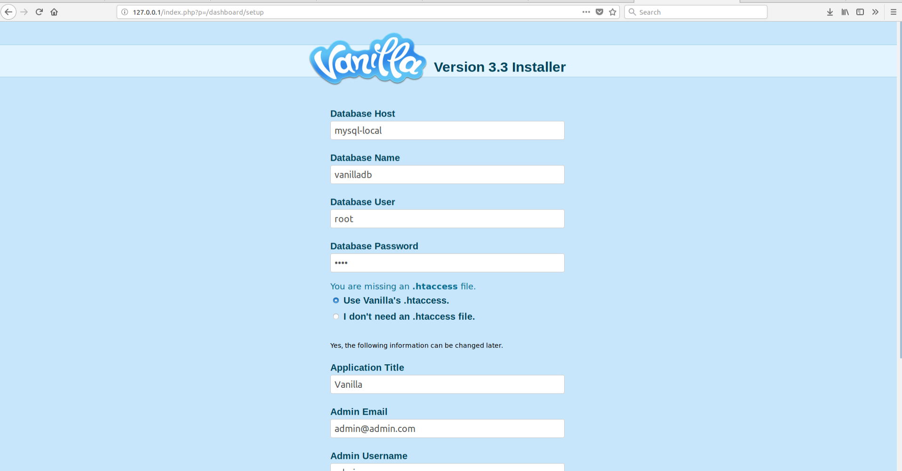
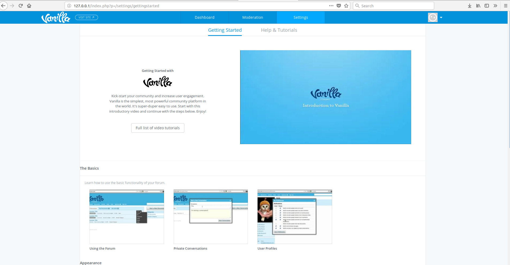
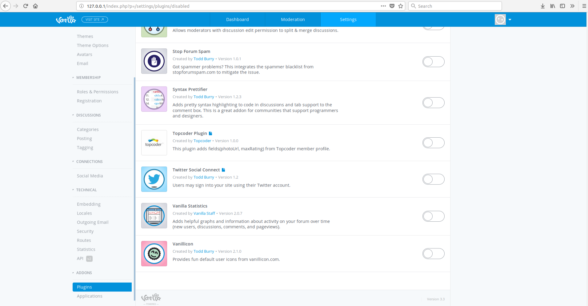
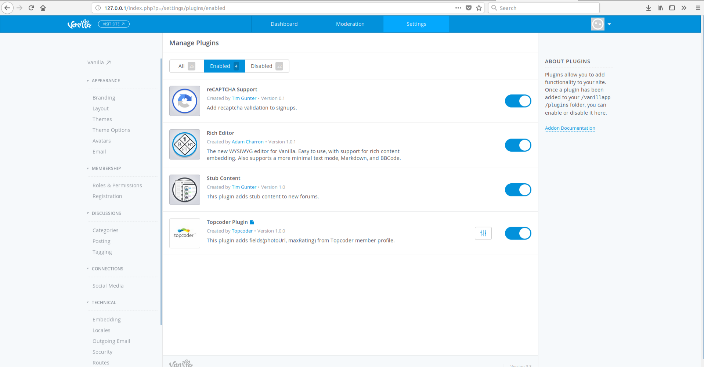

# Setup Vanilla Forums

# Installation
The Vanilla Forums will be available at `http://<your_docker_machine_ip>` by default.

1.Open your browser and go to Vanilla Forums. 

2.You should see Vanilla Forums setup wizard. Vanilla Forums Installer will
create a database and an admin account. You should type the next values: 
 - **Database Host** - `mysql-local` 
 - **Database Name** - `vanilladb`
 - **Database User** - `root`
 - **Database Password** - `root`
 - **Use Vanilla's .htaccess** - selected by default. 
 
 Type other fields. Click on the `Continue` button to complete the installation.
 
  
 
3.The 'Getting started' page should be displayed. You have successfully installed Vanilla Forums.

 

# Configuration

## Enabling Addons
1.Go to your `Dashboard`, then `Settings`, and select `Addons` at the bottom of the list on the left 
hand side panel. Navigate to the addons list and click `Enable` next to the plugin. 
Enabling the addon immediately makes it active and available.

 

2.After enabling some plugins will have a `Settings` 3-strip button that appear next to them in
the Addons list.

 

## Disabling Addons
1. Disabling an addon will remove whatever features it added, but it never destroys the data associated with it.
 

